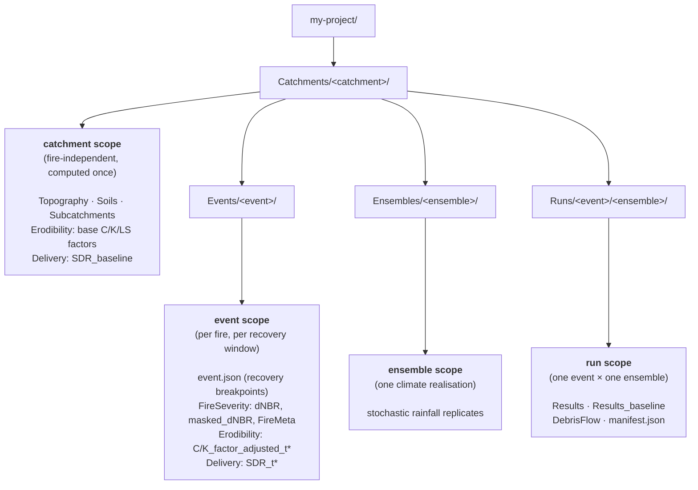
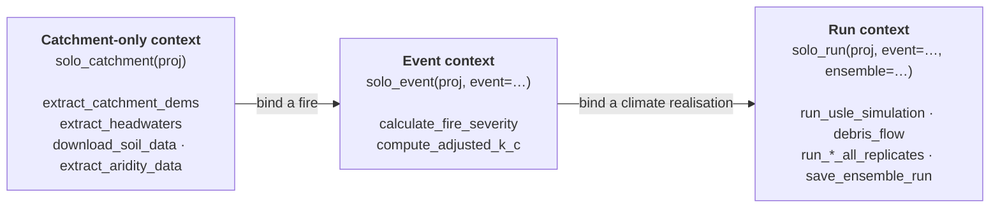

# Bushfire impacts on water quality

This Python package contains functionality for modelling the impacts of bushfire on the water quality of catchment runoff. The functionality is packaged as a library, intended to be used from a Python data science environment, such as Jupyter or Spyder, or incorporated into other scripts.

The library includes functionality for simulating erosion processes and debris flow and includes data pre-processing functionality intended to work with commonly available datasets (DEM-H, Soil and Landscape Grid of Australia, Sentinel-2 derived dNBR).

The package is designed for, and is being tested on, Australian conditions.


## Installation

The library can be installed using `pip` and assumes that you have a functioning 'scientific Python' installation, such as you might get by installing Anaconda Python.


### Dependencies

We have assumed the user has an existing Python distribution including the most common libraries for scientific and numerical computing (eg `numpy`, `scipy`, `pandas`). Additiona dependencies are listed in `requirements.txt` and can be installed using conda from the command prompt:

```
conda install --yes --file requirements.txt
```

In environments without conda, install with pip:

```
pip install -r requirements.txt
```

If you don't currently have a Python environment, we recommend using [Miniforge](https://github.com/conda-forge/miniforge/releases) as a starting point. See [INSTALLATION-MINIFORGE.md](INSTALLATION-MINIFORGE.md) for instructions on installing this package and the required dependencies in Miniforge.

### Install core library

1. Download the provided zip file and unzip to a convenient location.
2. Open a command prompt with your Python data science environment activated (eg open 'Anaconda Command Prompt')
3. Switch to the installation directory and run

 ```
 pip install .
 ```

 Alternatively, to keep the downloaded copy of the code editable after installation, use:

 ```
 pip install -e .
 ```

## Usage

The library supports two different modes:

1. A **high level interface**, where the library manages key datasets in a standard directory structure, and
2. A **low level interface**, where the user is responsible for data management.

We anticipated that the high level interface will suit most people, most of the time.

### Data requirements

The following table lists the key data requirements for the library. The user must provide a catchment boundary and have local access to the DEM-H for their area. The hihg level interface automatically retrieves the other data sources from published web services.

| Data | Source |
|------|--------|
| Catchment / study area boundary | User provided |
| DEM | DEM-H (local file) |
| Soils | Soil and Landscape Grid of Australia (TERN web service, API key required) |
| dNBR | Sentinel 2 (DEA Web service) |

### High level interface

The high level interface is implemented through the `FireImpactsProject` class, which creates and manages a folder structure containing the relevant data inputs to the water quality analyses, included processed input data and simulation results.

```python
from fire_impacts import FireImpactsProject
project = FireImpactsProject('./my-project')
```

A single `FireImpactsProject` can manage data associated with one or catchment areas, provided initially as catchment boundaries:

```python
project.add_catchment('big-river-catchment-boundary-boundary.shp',name='Big-River')
```

#### How a project is organised

A single project can model **more than one fire** in a catchment, each driven by **more than one stochastic rainfall realisation**. To keep this tractable — and to avoid recomputing shared inputs — the `FireImpactsProject` organises data along three axes inside each catchment:

- **Events** — individual fires. Each event has its own fire dates and recovery windows.
- **Ensembles** — stochastic rainfall realisations (e.g. a historical climate, or a future scenario). The same ensemble can drive several fires.
- **Runs** — the pairing of one event with one ensemble. A simulation happens *in a run*.

Data is stored at the **narrowest scope it depends on**. Fire-independent work (the DEM, headwaters, soils, the base RUSLE factors) is computed once per **catchment** and shared by every fire. Fire-specific layers live under the **event**. Rainfall lives under the **ensemble**. Simulation outputs live under the **run**:



The same structure, as it appears on disk:

```
my-project/
├── settings.json
└── Catchments/
    └── Big-River/
        ├── Topography/                     # catchment scope: DEM, slope,
        ├── Soils/                          #   headwaters, aridity, soil props
        ├── Erodibility/                    #   base C_factor, K_factor, LS_factor
        ├── Delivery/                       #   SDR_baseline
        ├── Subcatchments/
        ├── Events/
        │   └── 2019_fire/                  # event scope (one fire)
        │       ├── event.json              #   recovery breakpoints
        │       ├── FireSeverity/           #   dNBR, masked_dNBR, FireMeta.csv
        │       ├── Erodibility/            #   C/K_factor_adjusted_t0, _t0_5, ...
        │       └── Delivery/               #   SDR_t0, SDR_t0_5, ...
        ├── Ensembles/
        │   └── historical/                 # ensemble scope: rainfall replicates
        └── Runs/
            └── 2019_fire/
                └── historical/             # run scope (event x ensemble)
                    ├── Results/            #   RUSLE grids, timeseries, summaries
                    ├── Results_baseline/   #   no-fire comparison
                    ├── DebrisFlow/         #   debris-flow outputs
                    └── manifest.json
```

#### Addressing data with a `RunContext`

Because data lives at different scopes, the pre-processing and simulation functions do not take a bare `FireImpactsProject` — they take a **`RunContext`**, a small immutable object that binds a *project + catchment* and, optionally, an *event* and *ensemble*. There are three binding levels, each with a convenience constructor:

| Binding level | Constructor | Used for |
|---|---|---|
| **Catchment-only** | `RunContext.solo_catchment(proj)` | fire-independent prep — DEM, headwaters, soils |
| **Event-level** | `RunContext.solo_event(proj, event=...)` | per-fire prep — fire severity, fire-adjusted erodibility & SDR |
| **Run-level** | `RunContext.solo_run(proj, event=..., ensemble=...)` | simulation and its outputs |



Each constructor resolves the catchment automatically when the project has exactly one; otherwise pass `catchment=`. The context then resolves the correct scope for you — for example `ctx.event_path('FireSeverity', 'dNBR.tif')` for an event context or `ctx.run_path('Results', 'RUSLE_sum_total.tif')` for a run context — so functions read and write to the right place without the caller managing paths:

``` python
from fire_impacts.context import RunContext
from fire_impacts.pre import topography, severity

# Catchment-only work (no fire involved):
prep = RunContext.solo_catchment(project)
topography.extract_headwaters(prep)

# Per-fire work binds an event:
fire = RunContext.solo_event(project, event='2019_fire')
severity.calculate_fire_severity(fire, fire_start_date='2019-01-15',
                                 fire_end_date='2019-03-07')
```

To process every catchment, event or run already present on disk, use the matching enumerators, which yield one context per combination:

``` python
for ctx in RunContext.enumerate_events(project):   # every (catchment, event)
    ...
```

The high level interface automatically harmonises data wherever possible, bringing different imported datasets into a common coordinate reference system and resolution and clipping datasets to the relevant catchment boundaries.

Internally, the high level interface calls the underlying functionality from the low level interface.

### Low level interface

The low level interface provides access to the core functionality of the library while leaving the user/caller to manage data storage, I/O and harmonisation.

**Note:** The function calls in the low level interface are not yet consistent with each other and, as a result, are very likely to change as we refine the library.


### Worked example

A worked example, showing usage of the high level interface, is provided in the [examples/PrepareData.ipynb](examples/PrepareData.ipynb).


### Status

The following table summaries the status of each component of the library

| Stage | Functionality | Initial import | High level interface | Low level interface | Case study 1 | Case study 1 validated | Case study 2 | Case study 2 validated |
|-------------|-------|-------------|--------------------|---------------------|------------|--------------------|------------|------------|
| **Pre-processing** | Topographic | :heavy_check_mark: | :heavy_check_mark: | :construction: | :heavy_check_mark: | | | |
| | Fire severity | :heavy_check_mark: | :heavy_check_mark: | :construction: | :heavy_check_mark: | | | |
| | Soils | :heavy_check_mark: | :heavy_check_mark: | :construction: | :heavy_check_mark: | | | |
| | Erodibility | :heavy_check_mark: | :heavy_check_mark: | :construction: | :heavy_check_mark: | | | |
| | Stochastic Rainfall | :heavy_check_mark: | | :construction: | | | | |
| **Simulation** | Erosion | :heavy_check_mark: | :heavy_check_mark: | :construction: | :heavy_check_mark: | | | |
| | Debris | :heavy_check_mark: | | :construction: | :heavy_check_mark: | | | |

**Note:** The low level interface is very likely to change.

## Organisation

The core library code is stored in `fire_impacts` directory. The code repository also includes key parameter files, examples and test data.

| Directory | Contents |
|-----------|----|
| `<top-level>` | |
| `├── data` | Common parameter files (eg concentrations of pollutants in ash and debris) |
| `├── examples` | Worked example notebooks (jupytext `.py` + `.ipynb`) |
| `├── templates` | Copyable starter notebooks for a new study (PrepareData, Simulation, SimulationEnsemble, SourceIntegration) |
| `├── test_data` | Small spatial datasets to support examples and unit tests |
| `└── fire_impacts` | Library code |
| `    ├── context.py` | `RunContext` + `EventDefinition` (project / catchment / event / ensemble addressing) |
| `    ├── pre` | Data pre-processing (topography, severity, soils, RUSLE factors) |
| `    ├── sim` | Simulation (RUSLE erosion, debris flow, ensembles, results I/O) |
| `    ├── stochastic` | Stochastic rainfall replicate generation |
| `    ├── source` | eWater Source integration (via Veneer) |
| `    └── */tests` | Unit and integration tests, alongside each package |


## Funding, development and support

This project is funded by a consortium of Australian water utilities through Water Research Australia and by the National Emergency Management Agency.

The project was undertaken by Alluvium Consulting with support from Flow Matters.

For questions relating to the use of the library, please contact Joel Rahman (joel@flowmatters.com.au).

